---
author: Nemo
title: SpecGAN - GAN for audio generation
date: 2023-02-23
summary: My Notes on the SpecGAN, a audio generation model
aliases: ["/SpecGAN"]
math: true
ShowBreadCrumbs: false
--- 
# Adversarial Audio Synthesis

With the rise of GANs and the possibilities they offer, the question of whether or not they are capable of being successfully applied to the field of audio synthesis has arisen. GANs have brought about a revolution in the field of computer vision for a variety of applications, including the generation of images and the enhancement of picture resolution(image super resolution). Research in the fascinating topic of audio synthesis, which has numerous useful applications in the field of natural language processing, is an area that has attracted a lot of attention recently. The operation of GANs on image-like representations of audio, such as spectrograms, would be a simplistic approach to the problem of applying GANs to audio. Nevertheless, because spectrograms are not capable of being inverted, using this method results in lossy estimations, which makes it impossible to listen to the data.
Autoregressive models, as opposed to GANs, such as WaveNet and SampleRNN operate on raw audio to produce high quality output; nevertheless, this process is however slow because the output audio samples have to be fed back into the model. GANs are an alternative to autoregressive models. In the paper [1] written by Christian Donahue, the authors present two distinct methods/strategies for using GANs to generate one-second chunks of audio. These strategies are as follows:
- SpecGAN
- WaveGAN

Both these approaches use the DCGAN architecture for the purpose of audio synthesis. Their experiments showed that both WaveGAN and SpecGAN can generate spoken digits that are intelligible to humans.

## SpecGAN, A Frequency Domain Audio Generation Model
SpecGAN is the frequency domain audio generation model. It uses spectrograms as audio representations for image generation and can be approximately inverted. The spectrograms are of size of 128x128 which yields 16384 samples.In order to process the audio into suitable spectrogram, the audio preprocessing pipeline is given as:
- STFT of the audio with a window size of 16ms and a hop length of 8 ms and mel channels of 128.
- Magnitude of the resultant spectra
- Scaling amplitude values logarithmically to better align with human perception
- Normalizing each frequency bin to have zero mean and unit variance

## Evaluation and Results
The authors use the inception score and nearest neighbor comparisons for quantitative evaluation and human judgment for qualitative evaluation when assessing the quality of the models. The phase shuffle, which was presented in this paper, was thought to be a valuable addition to the WaveGAN model, whereas in SpecGAN it did not achieve very significant results. SpecGAN had a better performance than WaveGAN when it came to quantitative measures, but WaveGAN was the better choice when it came to qualitative measures.

## My Results
Upto 400 epochs

|                  0                  |                  100                  |                  200                  |                  300                  |                  400                  |
|:-----------------------------------:|:-------------------------------------:|:-------------------------------------:|:-------------------------------------:|:-------------------------------------:|
|  | 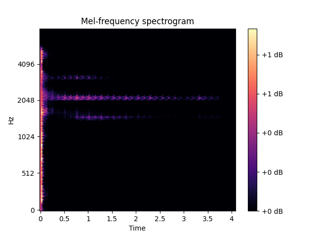 | 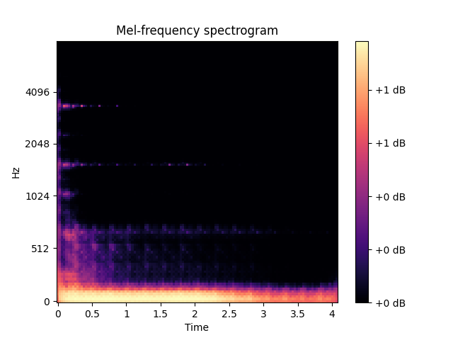 | 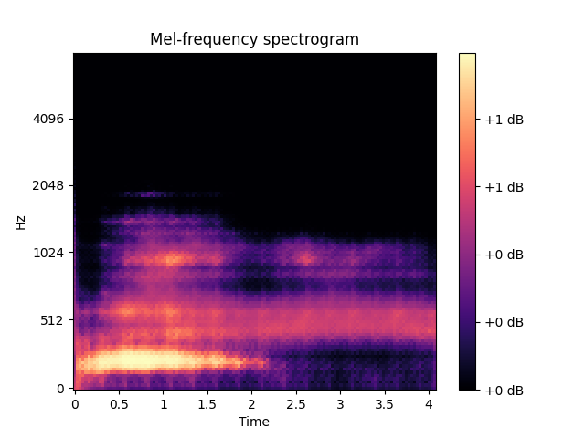 | 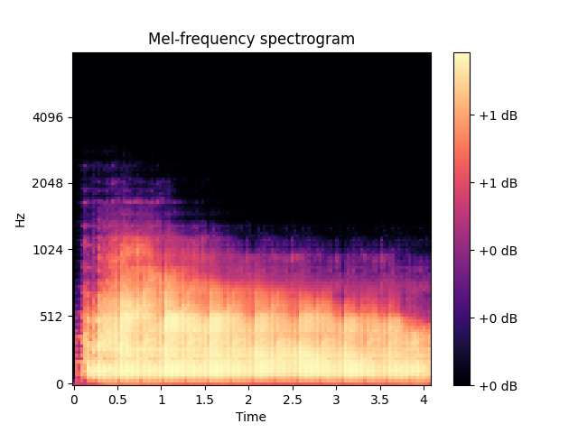 | 
| 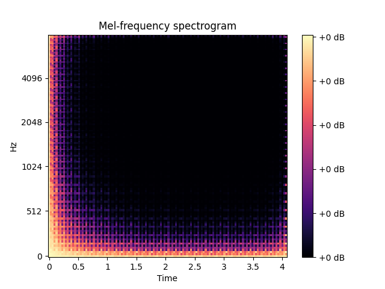 | 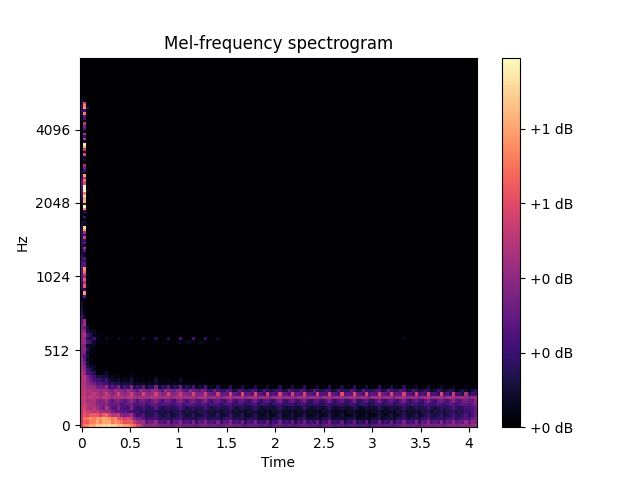 |  | 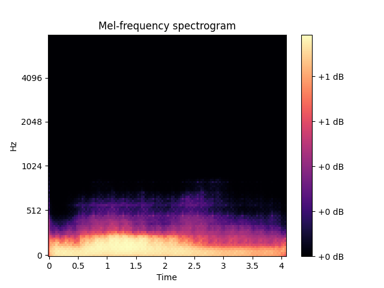 | 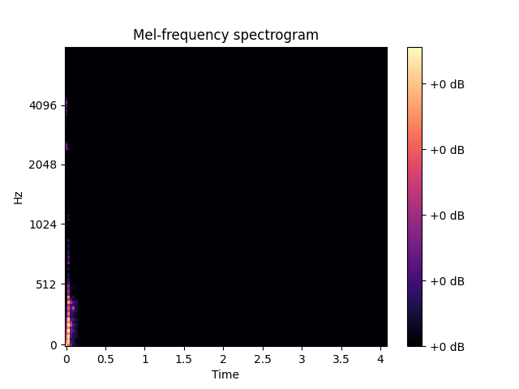 |
| 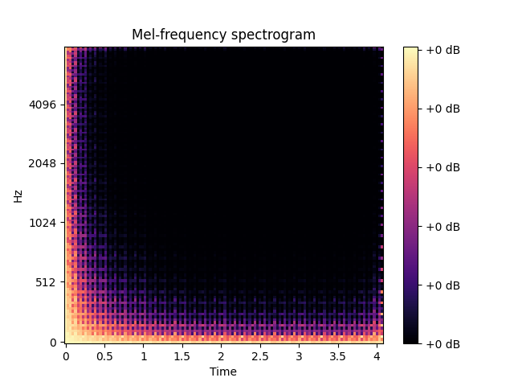 | 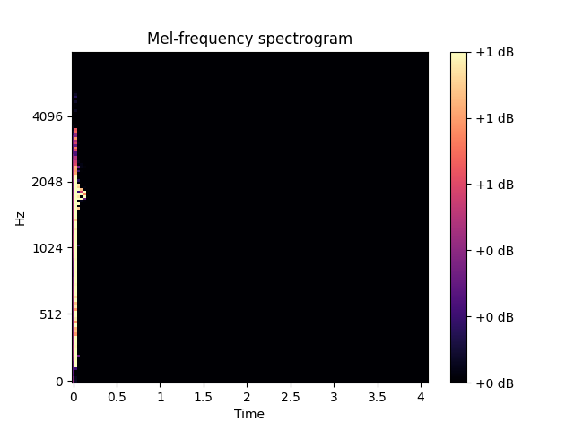 | 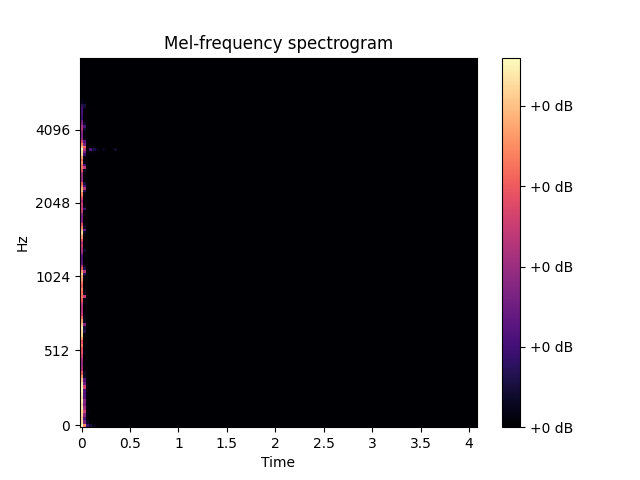 | 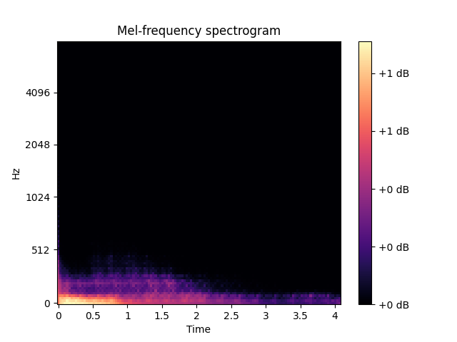 |  |
|  | 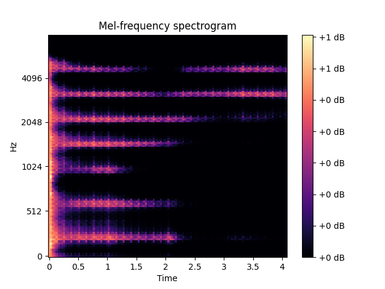 | 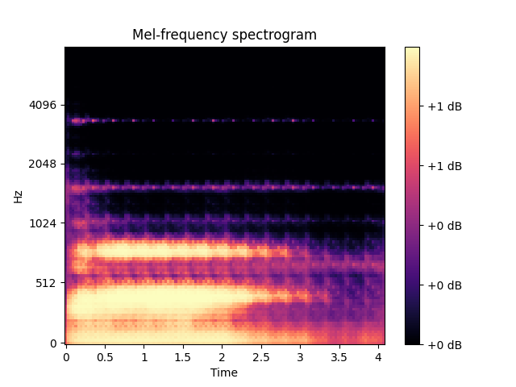 | 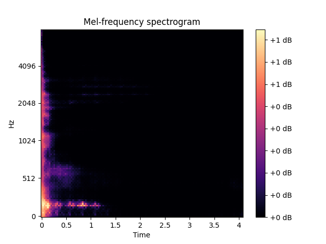 | 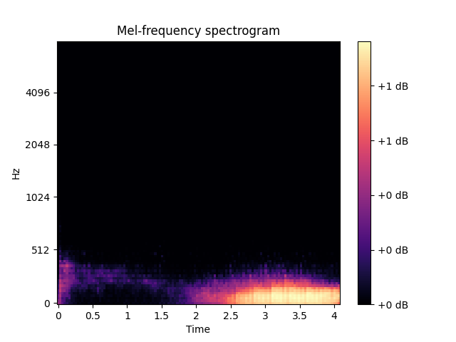 |
|  | 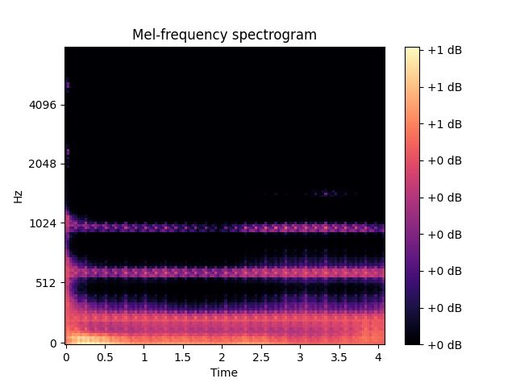 |  | 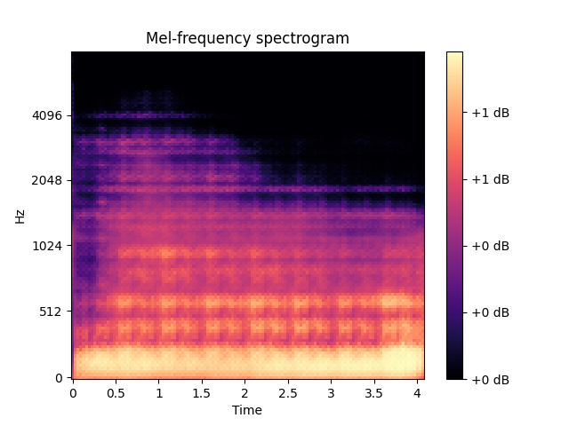 | 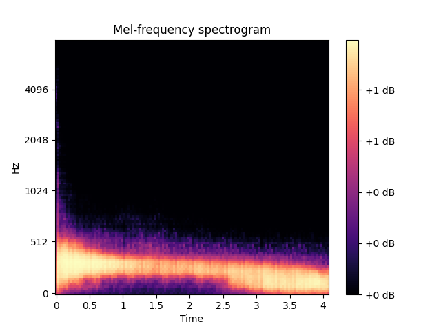 |

## References
1. https://arxiv.org/abs/1802.04208
2. https://github.com/chrisdonahue/wavegan
3. https://github.com/naotokui/SpecGAN
4. https://medium.com/octavian-ai/a-simple-explanation-of-the-inception-score-372dff6a8c7a

[1]: https://arxiv.org/abs/1802.04208

**_NOTE:_**  The training is not yet completed and the results will be updated soon. This is a work in progress. 